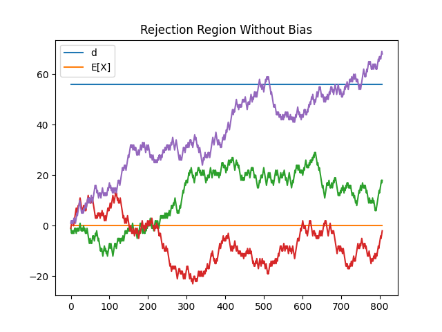
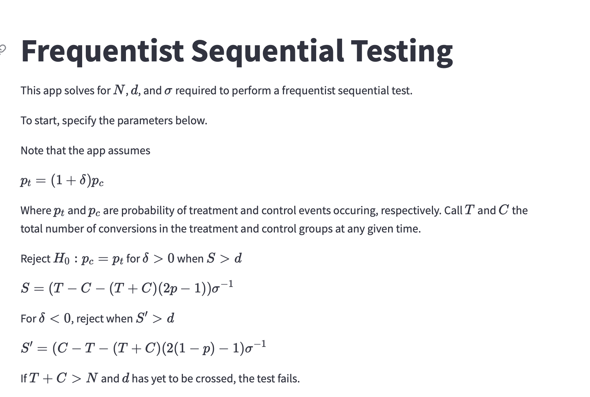
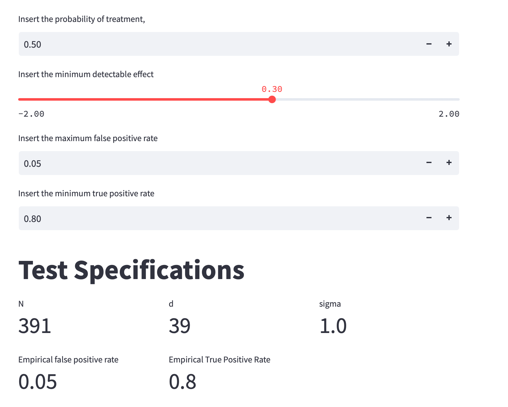

# freqseq

## Intro

`freqseq` stands for "Frequentist Sequential" and is an implementation of one sided frequentist sequential A/B testing in  `python`. Credit for the initial derivation goes to [Evan Miller](https://www.evanmiller.org/sequential-ab-testing.html). I've simply gone over his derivation in more granularity, added calculations dealing with treatment assignment bias, and written a `python` implementation. 

## Repo Contents

1. [`notes.md`](notes.md) - a derivation of the testing approach
2. [`app.py`](app.py) - a `streamlit` app which generates test statistics for various input conditions
3. [`freqseq`](freqseq) - a `python` package containing implementation of the testing strategy

## Problem

Suppose we are running a random experiment to determine the efficacy of some intervention with a **binary response** (the response taking the value of $1$ is called a "conversion"). We would like to end this experiment early if results look promising without "peeking" (peeking incurs bias by effectively testing multiple hypotheses). 

What we want here is a **sequential test**, a test that allows for early stopping if results look promising without incurring a heightened false positive rate. 

The basic strategy is to construct a random walk dependent on conversions in a treatment and control group. We can then define a region such that the random walk escapes that region at fixed rates under the both the hypothesis of equal conversion rates in the treatment and control groups and the hypothesis of unequal rates in each group. 

The test is defined by three parameters:
1. $N$ - the maximum amount of time to run the test (vertical barrier)
2. $d$ - the horizontal barrier - if the walk escapes $d$, we reject the null hypothesis. 
3. $\sigma$ - a variance conversion factor to transform the data into a random walk when treatment assignment probability is biased. 

Here is an example of what the region could look like:

See [here](notes.md) for more information on test construction. 

## Install

Modeling and code development was done in `conda` with `python 3.9.12`. 

Requirements are stored in `requirements.txt`.

To run the app, activate your `conda` environment, then run `streamlit run app.py`

The app should look something like this:

