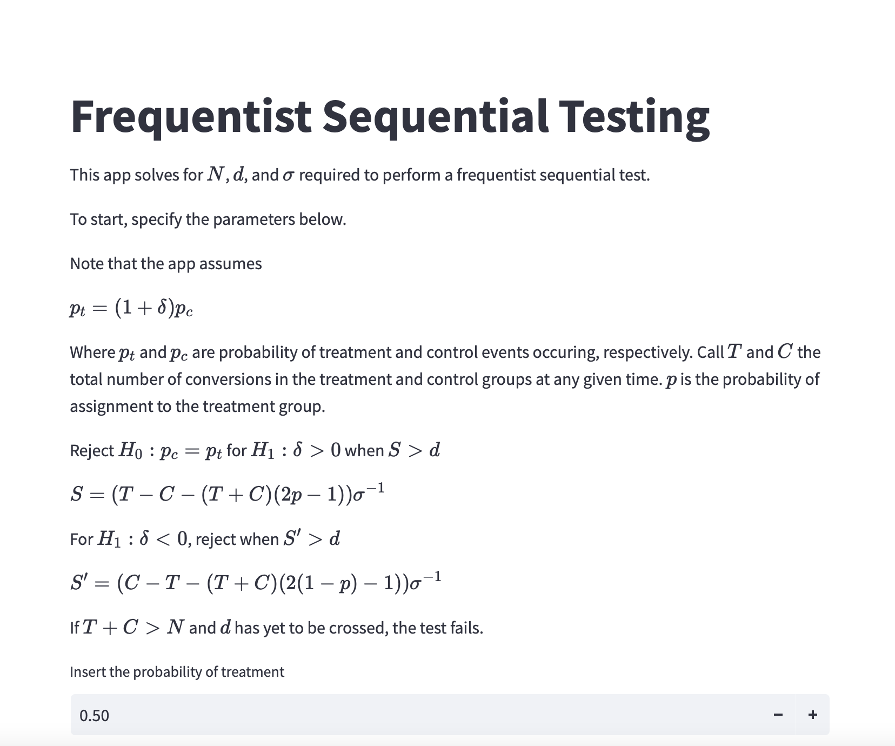
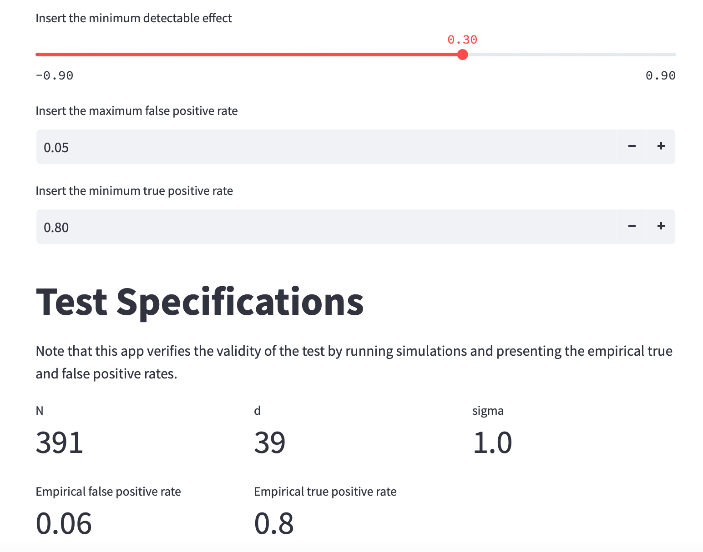

# freqseq

## Intro

`freqseq` stands for "Frequentist Sequential" and is an implementation of one sided frequentist sequential hypothesis testing in  `python`. Credit for the initial derivation goes to [Evan Miller](https://www.evanmiller.org/sequential-ab-testing.html#notes). I've simply gone over his derivation in more granularity, added calculations dealing with treatment assignment bias, and written a `python` implementation. 

## Problem

Suppose we are running a random experiment to determine the efficacy of some intervention. We would like to end this experiment early if results look promising without "peeking" (peeking incurs bias by effectively testing multiple hypotheses). 

What we want here is a **sequential test**, a test that allows for early stopping if results look promising without incurring a heightened false positive rate. 

## Install

Modeling and code development was done in `conda` with `python 3.9.12`. 

Requirements are stored in `requirements.txt`.

To run the app, activate your `conda` environment, then run `streamlit run app.py`

The app should look something like this:

## Repo Contents

1. `notes.md` - a derivation of the testing approach
2. `app.py` - a `streamlit` app which generates test statistics for various input conditions
3. `freqseq` - a `python` package containing implementation of the testing strategy

