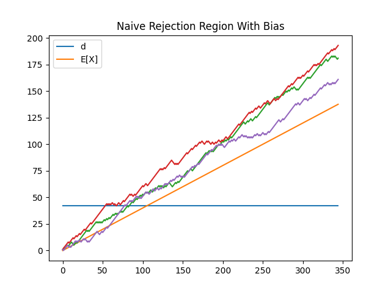
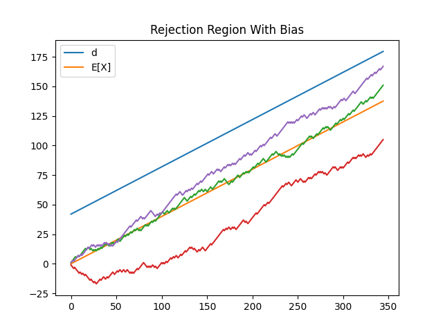

# Frequentist Sequential Testing

These notes give a derivation of an approach for one sided frequentist sequential testing where treatment assignment is biased. Again, credit for the proof in the unbiased case goes to [Evan Miller](https://www.evanmiller.org/sequential-ab-testing.html#notes). My work here dives into a bit more detail in the math (I needed to work through it to trust it) and covers the biased treatment case, which as you will see is not trivial. 

Excuse the royal we. Old habits die hard. 

### Goal

As discussed in the [README](README.md), the goal here is to allow early stopping of an A/B test without violating initial experiment design constraints (signficance and power). 

### Random Walk

We construct a sequential test using a random walk. More specifically, suppose we have two groups, $C$ and $T$, or control and treatment. We assign individuals to $C$ with probability $1- p$ and individuals to $T$ with probability $p$. Individuals in each group "convert" with rates $p_c$ and $p_t$. 

We are interested in 

$$ H_0 : p_c = p_t $$

and 

$$ H_1: p_c > p_t $$

Each individual is then a random variable, $X_i$, with $P(X_i = 1) = pp_t$ and $P(X_i = -1) = (1-p)p_c$. 

$$S_k = \sum_{i=1}^k{X_i}$$

 is then a biased random walk. Under $H_0$, $p_c = p_t$, so we can effectively estimate $S_k$ with bias $p$.

Note that the following is an unbiased random walk under $H_0$:

$$ \tilde{S_k} = \sum_{i=1}^k{X_i} - k(2p -1) $$

since $E[X] = p - (1 - p) = 2p - 1$

### Test Statistic

The test is defined by choosing a barrier, $d$, and a number of conversions, $N$, such that the probability of the walk escaping the region under $H_0$ is less than $\alpha$ for some predefined false positive rate. 

This is easy to understand visually. When $p  = \frac{1}{2}$, this region would look something like this 

When $p \neq \frac{1}{2}$, as is the case here, this problem becomes more difficult. 

Naively, if we were to use to use the same value of $d$, we would get a non functional test due to the bias in the walk, as seen below. 

The walk now moves upwards with a positive equal to the expectation under $H_0$. 

One solution is to use, instead of $d$, $d(n) = d + n(2p-1)$. This would look something like this:

This is clearly a random walk moving along the the axis of $y = x(2p -1)$. The question becomes, can we transform that random walk into one moving along the origin and then use Evan's derivation?

### Caveat - Unequal Steps

Consider the walk moving along $y = x(2p - 1)$. Define $\theta$ as the angle that the line makes with $y=0$. In this case, 

$$cos\theta = \frac{1}{\sqrt{(2p - 1)^2 + 1}}$$

Then, if the walk moves from $(x, y)$  to $(x + 1, y+ 1)$, 

it travels the following distance towards $y = (2p - 1)x + d$:

$$ d_0 - d_1$$

where 
    $$d_0 = cos\theta |(2p - 1)x - y + d|  $$

and 

$$ d_1 = cos\theta |(2p - 1)(x + 1)  - y - 1 + d|$$

If the walk steps downwards, it travels a distance of 

$$ d_1 - d_0$$

where now 

$$ d_1 = cos\theta |(2p - 1)(x + 1)  - y + 1 + d|$$

As $p \rightarrow \frac{1}{2}$, the distances approach $-1, +1$. **But as $p \rightarrow 1$, the walk now longer becomes symmetric. This means that any of Evan's derivations that assume a symmetric random walk are no longer valid and must be recalibrated using simulation modeling.**

The test procedure is thus as follows:
1. Define $Z = \frac{X - (2p - 1)}{\sigma}$ and define $Y \sim Bernoulli(\frac{\mu + 1}{2})$ such that $E[Y] = E[Z]$ and $Var(Y) = Var(Z)$. The idea is that $Y$ is a  bernoulli random variable that creates a random walk along the horizontal axis with the same mean and variance as $Z$, the random walk created by transforming the biased difference of treatment and control successes. **We are transforming our biased random walk to an unbiased asymmetrical random walk and then approximating that walk with a symmetrical random walk so we can use Evan's derivation.**
2. Solve for $\mu$ and $\sigma$ using the fact that $E[X]$ and $Var(X)$ are known. 
3. Use $Y$ in Evan's derivation. This will change the probaiblity of the walk moving under $H_1$. 
3. Recalibrate results using [bayesian optimization](https://scikit-optimize.github.io/stable/modules/generated/skopt.gp_minimize.html) in order to satisfy power and significance constraints because for large $p$, the asymmetrical step sizes cause $S_k = \sum_{i \leq k} X_k$ to no longer be a symmetrical random walk whereas $\sum_{i \leq k} Y_k$ will always be symmetrical.

### Solving for $\mu$ and $\sigma$

Call $p'$ the probability of the walk stepping upwards. Under $H_0$, $p' = p$. We will solve for $p'$ later. 

Define $E[X] = v = 2p' - 1$. Define $w = 2p - 1$. Then, $Var(X) = 1 - v^2$ since $X$ is a bernoulli random variable. 

It follows that 

$$E[Y] = \mu = \frac{v - w}{\sigma}$$

and 

$$ Var(Y) = \frac{1 - v^2}{\sigma^2} = 1 - \mu^2 $$

thus

$$ \sigma = \sqrt{(v - w)^2 +  1 - v^2}$$

With $\mu$ known, we can compute the walk's probabilty of moving upwards and then work with a symmetrical random walk that is unbiased under $H_0$. 

## Unbiased Random Walks 

As a reminder, we are interested in creating a test region defined by barrier $d$ and maximum number of conversions $N$ such that the probability of the walk escaping the region under $H_0$ is equal to $\alpha$, which could look like this:

To construct the test region, define $r_{n, d}$ as

$$ r_{n, d} = \frac{d}{n} {n \choose \frac{n + d}{2}} p ^ {\frac{n + d}{2}} (1 - p)^{\frac{n - d}{2}} $$

$r_{n, d}$ is the probability of reaching $d$ for the very first time after $n$ iterations of the random walk. The basic idea is that this requires $d$ treatment conversions and then a balance of $\frac{n - d}{2}$ treatment converisons and $\frac{n - d}{2}$ control conversions (so a total of $\frac{n + d}{2}$ treatment conversions). 

The term $\frac{d}{n} {n \choose \frac{n + d}{2}}$ comes from a clever argument using the [relection principle](https://www.uvm.edu/~sdaysmer/files/ballottheoremfinal.pdf) which can be read [here](https://bitcoinwords.github.io/assets/papers/an-introduction-to-probability-theory-and-its-applications.pdf)-  the key idea is that the probability of a walk at time $N$ and position $k < d$ having a maximum value of $d$ is the same as the probaiblity of a walk reaching the point $2d - k$ because we can construct an injective mapping of paths that cross $d$ and reach $k$, and paths that cross $d$ and reach $2d-k$, by multiplying the signs of steps by $-1$. **Importantly, if the walk is no longer symmetric, the rejction principle no longer makes sense,  and $r_{n, d}$ fails to approximate the probability of the walk crossing $d$. This is why calibration is needed.**

Next, define $R_{N, d}$ as 

$$ R_{N, d} = \sum_{n = 1} ^Nr_{n, d} $$

This is the probabilty of escaping the boundary $d$ in less than $N$ iterations. 

We can then choose $N$ and $d$ such that for some $\alpha$, 

$$ R_{N, d} < \alpha $$

Then if $S_k' = \sum_{i= \leq k} \frac{X_i - i(2p -1)}{\sigma}$ crosses $d$ for any $k \leq N$, we reject $H_0$. 

### Power

There are an infinite number of pairs $(N, d)$ that satisfy the significance equation. 

We can choose the pair to use by adding the following constraint:

$$ P(S_k' > d, k \leq N | H_1)  > \beta$$

where $\beta$ is the probability of rejecting the null under the alternative hypothesis. 

Under $H_1$, we need to solve for $p_c$ and $p_t$. For example, we may believe that customers who take some drug will die at a 10% lower rate than customers in a control group. First, specify some minimum effect size to detect, $\delta$. We can then write 

$$ p_t = (1 - \delta)p_c$$

$S_k$ steps up when a conversion takes place in the treatment group. $S_k$ only steps in *either* direction when a conversion takes place. If at time $k$, a customer is assigned to the control group and does **not** convert, the walk does not move. Thus, group assignement **and** conversion rate dictate how the walk moves. 

 Define $Z_t \sim Bernoulli(pp_t)$  and $Z_c \sim Bernoulli((1-p)p_c)$. $Z_t$ and $Z_c$ correspond to conversion in the treatment and control groups, respectively. 

To be more precise, the walk steps up under the event $Z_t  = 1 | Z_t + Z_c = 1$. The probability of this event occuring, $p'$, is defined as 

$$ p' = P(Z_t = 1 | Z_t + Z_c = 1) = 
\frac{P(Z_t + Z_c = 1 | Z_t = 1)P(Z_t = 1)}
{P(Z_t + Z_c = 1)} = 
\frac{p p_t}{ p p_t + (1 - p)p_c} $$

Thus 

$$ p'  = \frac{p ( 1-\delta)}{1 - p\delta} $$

And the probability of conversion in $C = 1 - p'= \frac{1 - p}{1 - p\delta}$

If we are considering the opposite case, where $p_t = (1 + \delta)p_c$, then 

$$p' = \frac{p(1 + \delta)}{1 +  p\delta}$$

and $1 - p'= \frac{1 - p} {1+ p\delta}$

**This is the same $p'$ from earlier; with it, solve for $\mu$ and note that the walk has bias that can be approximated as $\tilde{p} = \frac{\mu + 1}{2}$ under $H_1$.**

Thus, the equations to optimize become 

$$ \sum_{n= 1}^N\frac{d}{n} {n \choose \frac{n + d}{2}} p ^ {\frac{n + d}{2}} (1 - p)^{\frac{n - d}{2}} < \alpha$$

and 

$$ \sum_{n= 1}^N\frac{d}{n} {n \choose \frac{n + d}{2}} \tilde{p}^{\frac{n + d}{2}} (1 - \tilde{p})^{\frac{n - d}{2}} >\beta$$

For large $p$, $\alpha$ and $\beta$ may need to be recalibrated. 

### When $\delta < 0$

If $\delta < 0$, switch $p$ and $1 - p$ - the problem is now symmetric to $\delta > 0$. 