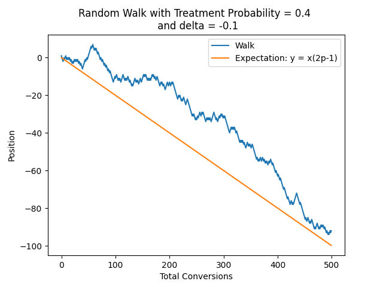
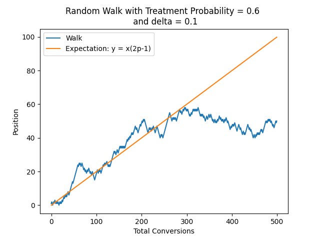

# Frequentist Sequential Testing

These notes give a derivation of a testing approach for one sided frequentist sequential testing where treatment assignment is biased. Again, credit for the proof in the unbiased case goes to [Evan Miller](https://www.evanmiller.org/sequential-ab-testing.html#notes). My work here dives into a bit more detail in the math (I neeed to work through it to trust it) and covers the biased case. 

Excuse the royal we. Old habits die hard, and it just plain sounds better. 

### Goal

As discussed in the [README](README.md), the goal here is to allow early stopping of an A/B test without violating initial experiment design constraints (signficance and power). 

### Random Walk

We construct a sequential test using a random walk. More specifically, suppose we have two groups, $C$ and $T$, or control and treatment. We assign individuals to $C$ with probability $1- p$ and individuals to $T$ with probability $p$. 

Individuals in each group "convert" with rates $p_c$ and $p_t$. 

We are interested in 

$$ H_0 : p_c = p_t $$

and 

$$ H_1: p_c > p_t $$

Each individual is then a random variable, $X_i$, with $P(X_i = 1) = pp_t$ and $P(X_i = -1) = (1-p)p_c$. 

$$S_k = \sum_{i=1}^k{X_i}$$

 is then a biased random walk. Under $H_0$, $p_c = p_t$, so we can effectively estimate $S_k$ with bias $s$.

Note that the following is an unbiased random walk:

$$ \tilde{S_k} = \sum_{i=1}^k{X_i} - k(2p -1) $$

### Test Statistic

The test is defined by choosing a bound, $d$, and a number of conversions, $N$, such that the probability of the walk escaping the region under $H_0$ is less than $\alpha$ for some predefined false positive rate. 

More specifically, define $r_{n, d}$ as

$$ r_{n, d} = \frac{d}{n} {n \choose \frac{n + d}{2}} p ^ {\frac{n + d}{2}} (1 - p)^{\frac{n - d}{2}} $$

$r_{n, d}$ is the probability of reaching $d$ for the very first time after $n$ iterations of the random walk. The basic idea is that this requires $d$ treatment conversions and then a balance of $\frac{n - d}{2}$ treatment converisons and $\frac{n - d}{2}$ control conversions (so a total of $\frac{n + d}{2}$ treatment conversions). The combinatorial handles the number of arrangements and the term $\frac{d}{n}$ controls for the fact that only $\frac{d}{n}$ of the ${n \choose \frac{n + d}{2}}$ paths arrive at $d$ conversions at exactly time $n$. For more information, see Chapter 3 of [this book](https://bitcoinwords.github.io/assets/papers/an-introduction-to-probability-theory-and-its-applications.pdf).

Next, define $R_{N, d}$ as 

$$ R_{N, d} = \sum_{n = 1} ^Nr_{n, d} $$

This is the probabilty of escaping the boundary $d$ in less than $N$ iterations. 

We can then choose $N$ and $d$ such that for some $\alpha$, 

$$ R_{N, d} < \alpha $$

Then if $S_k$ crosses $d$ for any $k \leq N$, we reject $H_0$. 

### Power

There are an infinite number of pairs $(N, d)$ that satisfy the significance equation. 

We can choose the pair to use by adding the following constraint:

$$ P(S_k > d, k \leq N | H_1)  > \beta$$

where $\beta$ is the probability of rejecting the null under the alternative hypothesis. 

Under $H_1$, we need to solve for $p_c$ and $p_t$. For example, we may believe that customers who take some drug will die at a 10% lower rate than customers in a control group. First, specify some minimum effect size to detect, $\delta$. We can then write 

$$ p_t = (1 - \delta)p_c$$

$S_k$ steps up when a conversion takes place in the treatment group. $S_k$ only steps in *either* direction when a conversion takes place. If at time $t$, a customer is assigned to the control group and does **not** convert, the walk does not move. Thus, group assignement **and** conversion rate dictate how the walk moves. 

Define $Y \sim Bernoulli(p)$ indicating assignment to treatment or control. Define $Z_t \sim Bernoulli(pp_t)$  and $Z_c \sim Bernoulli((1-p)p_c)$. $Z_t$ and $Z_c$ correspond to conversion in the treatment and control groups, respectively. 

To be more precise, the walk steps up under the event $Z_t  = 1 | Z_t + Z_c = 1$. The probability of this event occuring, $p^*$, is defined as 

$$ p^* = P(Z_t = 1 | Z_t + Z_c = 1) = 
\frac{P(Z_t + Z_c = 1 | Z_t = 1)P(Z_t = 1)}
{P(Z_t + Z_c = 1)} = 
\frac{p p_t}{ p p_t + (1 - p)p_c} $$

Thus 

$$ p^*  = \frac{p ( 1-\delta)}{1 - p\delta} $$

And the probability of conversion in $C = 1 - p^* = \frac{1 - p}{1 - p\delta}$

If we are considering the opposite case, where $p_t = (1 + \delta)p_c$, then 

$$p^* = \frac{p(1 + \delta)}{1 +  p\delta}$$

and $1 - p^* = \frac{1 - p} {1+ p\delta}$

Thus, the equations to optimize become 

$$ \sum_{n= 1}^N\frac{d}{n} {n \choose \frac{n + d}{2}} p ^ {\frac{n + d}{2}} (1 - p)^{\frac{n - d}{2}} < \alpha$$

and 

$$ \sum_{n= 1}^N\frac{d}{n} {n \choose \frac{n + d}{2}} (\frac{p ( 1-\delta)}{1 - p\delta}) ^ {\frac{n + d}{2}} (\frac{1 - p}{1 - p\delta})^{\frac{n - d}{2}} > \beta$$

## Bias in the Walk

Since $E[X_i] = 2p -1 $, the walk does not move along the origin. Instead, it travels along $i(2p - 1)$. 

This means that $d$ cannot be parallel to the origin but must also move in parellel to the walk (corrected for bias). 

### Case 1:  $p_t > p_c$

Here, $d$  becomes $d(n) = n(2p - 1) + d$. For ease of 
computation, take the integer part of this number. For sufficeintly large experiments, this won't impact the results too much. Further work should study how the change in coordinate system impacts test behavior. 

We care about when the walk crosses the *upper bound*, so we define our constraints based on $\frac{n + d(n)}{2}$ conversions in the **treatment group**.

In this example image, a "negative" version of $\delta$ corresponds to 
$p_t > p_c$ since in my code, $p_t = (1 - \delta)p_c$. Observe how the walk drifts downwards, but is biased upwards
as it moves around its expected value. 

### Case 2: $p_t < p_c$

Here, $d$  becomes $d(n) = n(2p - 1) - d$.

We care about when the walk crosses the *lower bound*, so we define our constraints based on $\frac{n + d(n)}{2}$ conversions in the **control group**. 

In this example, a positive value of $\delta$ means that $p_t < p_c$. Observe
how the walk drifts upwards, but is biased downwards around its expected value. 

## Two sided Test

For a two sided test, use Evan's assumption that, for large value's of $d$, the probability of reaching $d$ or $-d$ is the sum of both probabilities. Constraints will then need to depend on two values of $d$ - one for $p_c < p_t$ and one for $p_c > p_t$. This is left for later work and will probably require some nifty code optimization. 